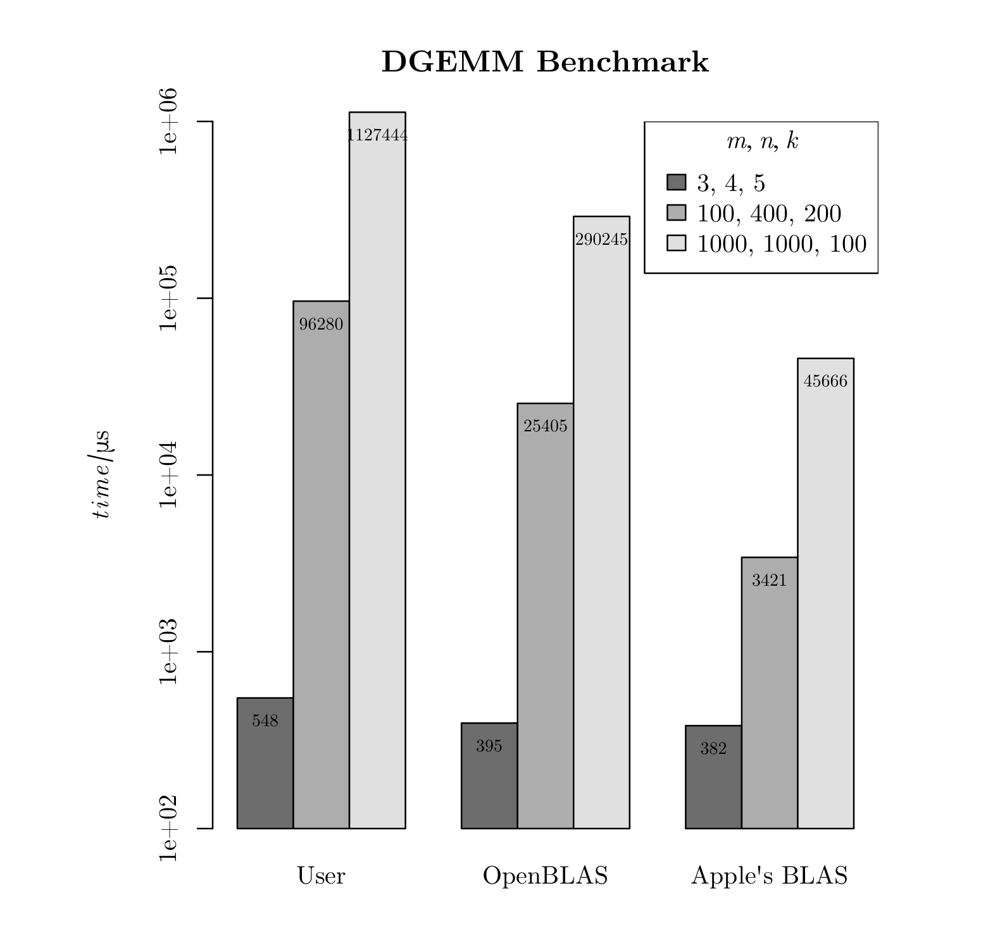

# Lab 2

## Overview

- `./gen_test_case.py`: generate test case input file `./test_case.in.txt` for benchmark. (Required numpy)
- `./gemm_c/`: C implementations of GEMM and benchmark wrapper.

## Benchmark

C benchmark include a naive algorithm, OpenBLAS and Apple's implementation of BLAS.

You might need to modify `./gemm_c/Makefile` to set the path of OpenBLAS, targetting platform and so on (especially when not on a Mac with M1 chip). The `Makefile` is pretty self-explained so I won't go into details here.

A possible output (us is a shorthand of micro second):

```
[PROGRAM ./target/bin_ablas START]

[DURATION] 564 us

[DURATION] 3441 us

[DURATION] 48524 us

real    0m0.127s
user    0m0.121s
sys     0m0.004s

[PROGRAM ./target/bin_oblas START]

[DURATION] 614 us

[DURATION] 26438 us

[DURATION] 330504 us

real    0m0.510s
user    0m2.576s
sys     0m0.040s

[PROGRAM ./target/bin_user START]

[DURATION] 589 us

[DURATION] 105434 us

[DURATION] 1126105 us

real    0m1.611s
user    0m1.600s
sys     0m0.008s
```

The barplot of above results:

