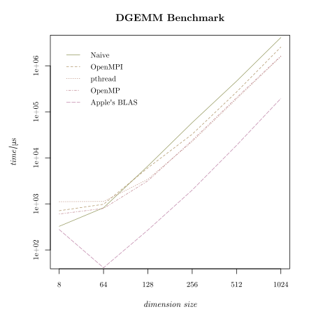

# Lab 5

## Overview

Similar to Lab 5.

## Set up on macOS

```bash
brew install llvm libomp openmp
source ./envrc
```

## Benchmark

C benchmark include a naive algorithm, Apple's implementation of BLAS, and a boosted naive algorithm utilizing OpenMP.

You might need to modify `./Makefile` to tweak the C toolchain, targetting platform and so on (especially when not on a Mac with M1 chip). The `Makefile` is pretty self-explained so I won't go into details here.

A possible output (us is a shorthand of microsecond):

```
[PROGRAM target/gemm_ablas START]

[DURATION] 277 us

[DURATION] 41 us

[DURATION] 270 us

[DURATION] 1997 us

[DURATION] 18650 us

[DURATION] 194895 us

[PROGRAM target/gemm_multi START]

[DURATION] 1115 us

[DURATION] 1129 us

[DURATION] 3425 us

[DURATION] 22586 us

[DURATION] 190886 us

[DURATION] 1588405 us

[PROGRAM target/gemm_omp START]

[DURATION] 603 us

[DURATION] 797 us

[DURATION] 3166 us

[DURATION] 23904 us

[DURATION] 202312 us

[DURATION] 1631776 us

[PROGRAM target/gemm_user START]

[DURATION] 326 us

[DURATION] 824 us

[DURATION] 6644 us

[DURATION] 58305 us

[DURATION] 463099 us

[DURATION] 4111110 us

[PROGRAM target/mpi/gemm_mpi START]

[DURATION] 710 us

[DURATION] 980 us

[DURATION] 6065 us

[DURATION] 32598 us

[DURATION] 269601 us

[DURATION] 2550128 us
```

The plot of above results:


